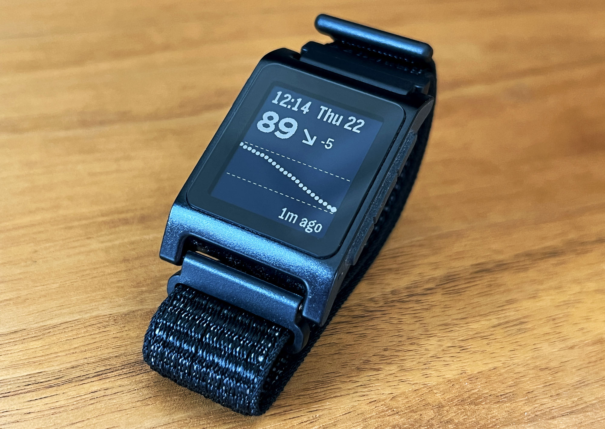
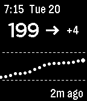
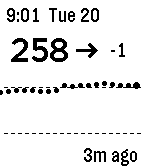

# T1000

A Pebble watchface that displays real-time Dexcom CGM glucose data.



## Features

 

- Current glucose value with trend arrow
- Delta (rate of change)
- Time since last reading
- 2 hour CGM history
- Supports mg/dL and mmol/L
- Configurable high/low threshold lines
- Configurable high/low alerts

## Missing Features

- Doesn't handle HIGH or LOW states currently
- Doesn't handle most error states

## Requirements

- B&W Pebble / Core 2 Duo watch (Aplite)
- Dexcom CGM with Share enabled
- Dexcom Share account credentials

## Building

```sh
npm install
pebble clean && pebble build && pebble install --cloudpebble --logs
```

## License

MIT
